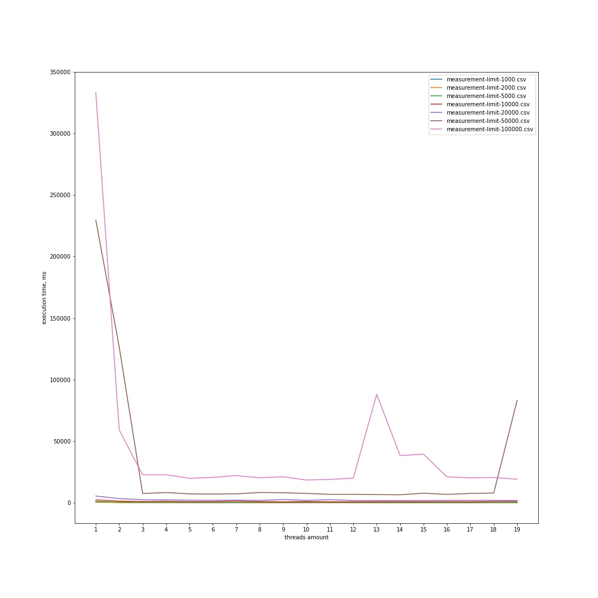
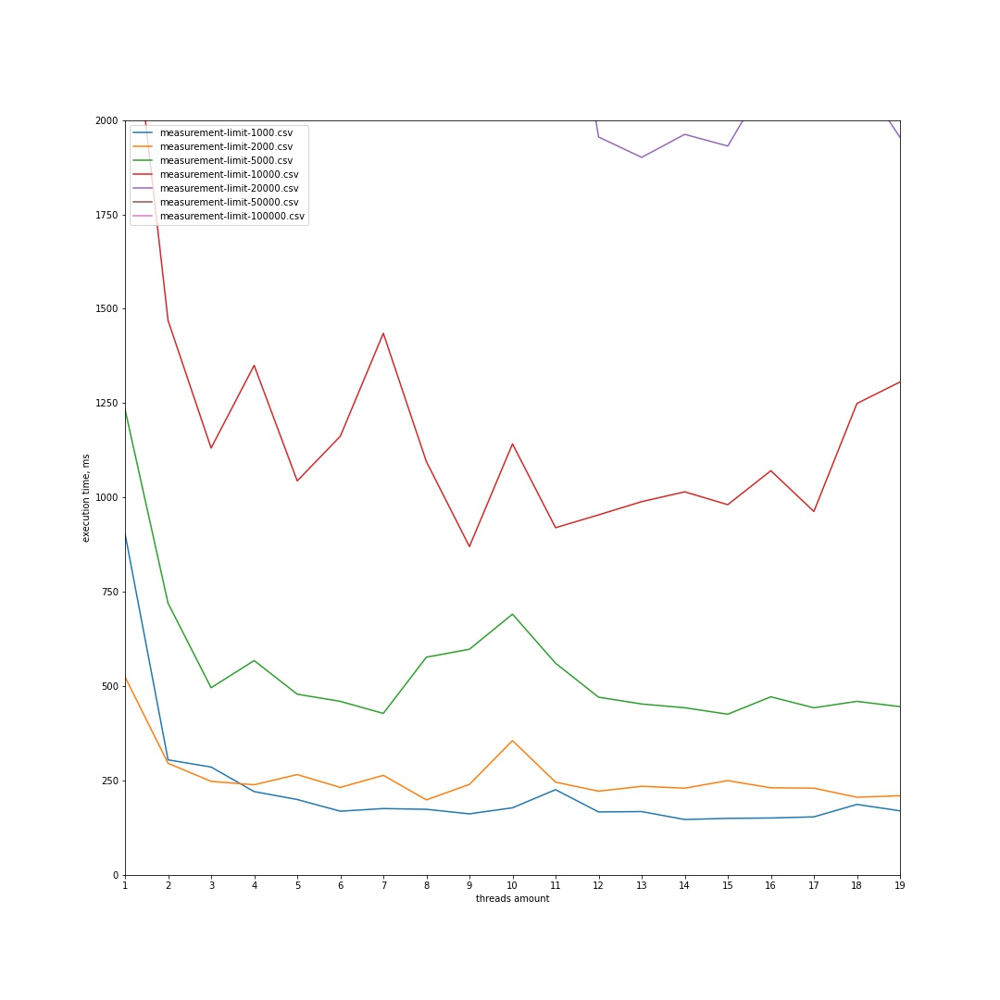

# Table of contents
- [Description](#Description)
- [Usage example](#Usage-example)
- [Requirements](#Requirements)
- [Project structure](#Project-structure)
- [Setup](#Setup)
  * [Cloning](#Cloning)
  * [Compiling sources](#Compiling-sources)
  * [Running](#Running)
- [Results](#Results)

# Description
The main task of the project is to implement parallel datastructure called [inverted index](https://en.wikipedia.org/wiki/Inverted_index) using `multithreading` i.e. the creation of such structure should be parallelized.

In the project you can find structure like that that was based on `ConcurrentHashMap` and `ConcurrentHashMap.entrySet()`. There is also a single threaded implementation of the index and a few handy utility classes that can be easily reused in the future projects such as paths extractors and tokenizers.

In addition to this, I've implemented a simple `client-server` logic with usage of index allowing clients to query an index via sending the queries to server.
# Usage example
```java
//root dirs to files
String[] paths = {"test/", "train/"};

// get extractor instance
var extractor =
        DirsFileNamesFileNameListExtractor.createExtractor(paths);
        
//set tokenizer
Tokenizer tokenizer = new SimpleTokenizer(Token.WORD);

// create index
IndexBuilder builder = new ConcurrentInMemoryIndexBuilder();
builder.setFileLineExtractor(new ReusableFileLineIterator());
builder.setTokenizer(tokenizer);
builder.setFileNameExtractor(extractor);
builder.setAutoBuild(true);

var index = builder.build();

// get list of file names by word
Set<String> fileNames = index.search("suspect was killed");

fileNames.forEach(System.out::println);
```

# Project structure
### General structure
```
  .
  ├─── bin                                              <-- compiled binaries
  ├─── documentation 
  ├─── lib                                              <-- depending libs
  ├─── measurements                                     <-- measurements folder
  │   └─── concurrent-hashmap-to-hashmap-entryset       <-- concrete impl test      
  │       └─── plots     
  ├─── scripts                                          
  ├─── src
  │   ├─── main.java.com.ua.wozzya
  │   │                         └─── wozzya
  │   │                             ├─── client
  │   │                             ├─── index
  │   │                             │   ├─── multi
  │   │                             │   └─── single
  │   │                             ├─── server
  │   │                             └─── utils
  │   │                                 ├─── extractor
  │   │                                 └─── tokenizer
  │   └─── test                                          <-- test(junit)
  ├─── test                                              <-- text data to be indexed
  │   ├─── neg
  │   └─── pos
  └─── train                                             <- also text data to be indexed
      ├─── neg
      ├─── pos
      └─── unsup
```

### Packages and classes hierarchy
```
 com.ua.wozzya
 │   AppClient.java    
 │   AppServer.java                                          
 │   Demo.java                                              
 │   PerformanceTest.java                                   
 │
 ├───client
 │        AbstractConsoleClient.java
 │        ActionConstants.java
 │        CyclicMessenger.java
 │        SimpleConsoleCyclicMessenger.java
 ├───index
     │   AbstractIndex.java
     │   AbstractIndexBuilder.java
     │   Index.java
     │   IndexBuilder.java
     ├───multi
     │       ConcurrentIndexBuilder.java
     │       ConcurrentInMemoryIndexBuilder.java
     │       ConcurrentInMemoryInvertedIndex.java
     └───single
     │       InMemoryIndexBuilder.java
     │       InMemoryInvertedIndexStandalone.java
     ├───server
     │       IndexClientHandler.java
     │       MultiConnectionIndexServer.java
     └───utils
         │   Pair.java
         │
         ├───extractor
         │       DirsFileNamesFileNameListExtractor.java
         │       Extractor.java
         │       FileLineIterator.java
         │       FileNameListExtractor.java
         │       ReusableFileLineIterator.java
         │
         └───tokenizer
                 SimpleTokenizer.java
                 Token.java
                 Tokenizer.java
```
# Requirements
- Java 11 and later 
- bash 4 (Linux) or WSL/GitBash/etc (Windows)
> If you want to mantain the project you'll also need an IDE and maven installed on your machine

# Setup
First of all, we need to clone repository to local machine
### Cloning
```sh
git clone https://github.com/WozzyaQ/client-server-inverted-index.git
```
### Compiling sources
Then, we need to compile sources. From the `project` directory run
```sh
cd scripts
./compile.sh
```
### Running
To run server, from the `script` directory run the following
```sh
./runserver <port> <paths>
```
`port` - server's endpoint\
`paths` - relative or absolute path (minimum 1) pointing to existing folders\

> On this step you may face a trouble finding a classloader.\
To fix this, you'll need to manualy fix scripts\
If you're running on Windows: change `:` to `;` in scripts files\
And vice versa for Linux: change `;` to `:`

After the server's script has been ran, the program will scan the folders and build an inverted index
>Do not start the client until server says that an index was built\

To run client, run the following
```sh
./runclient <ip> <port>
```
`ip` - server's ip address\
`port` - server's listening endpoint


# Visualizing execution time


More plots on different subsets of data can be found [here](./measurements/concurrent-hashmap-to-hashmap-entryset)
If you want to do your test - feel free to customize the code and measurements.\
For this I have an example file called `PerformanceTest.java` that can be modified on demand (basically a few changes need to be made to get the `.csv` output files)

Than you can run [Jupyter Notebook](https://jupyter.org) and customize `plots.ipynb` that lies down in the root of the project :)
